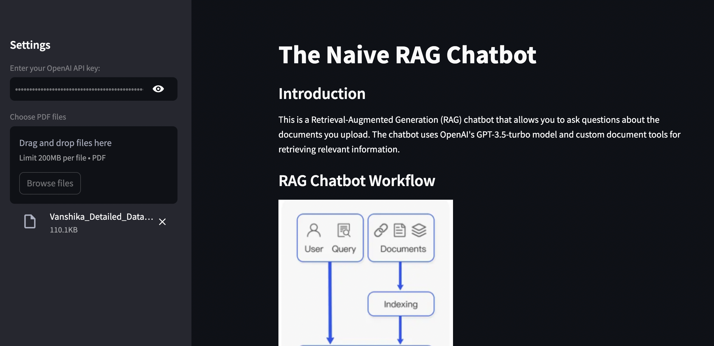
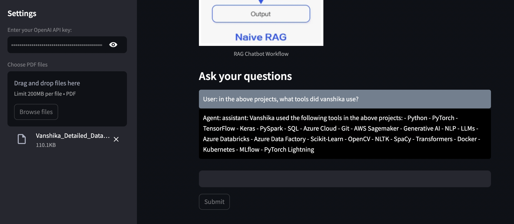
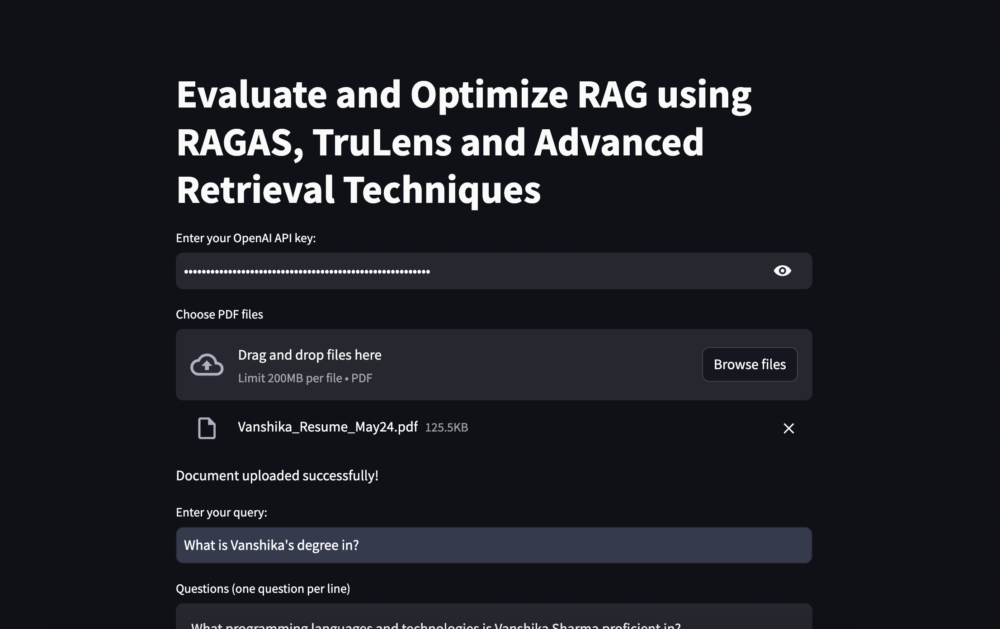
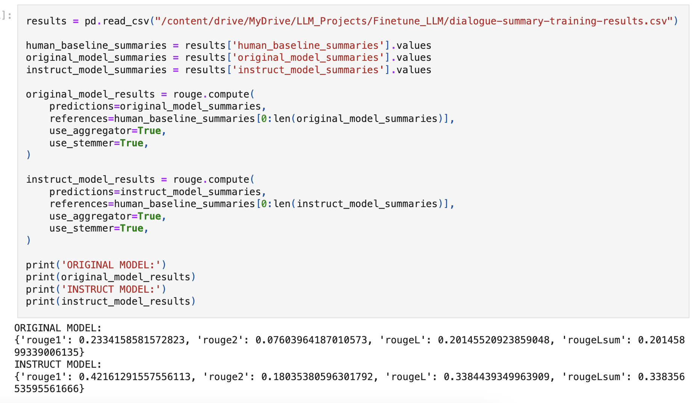

# Machine Learning Engineer

Turning Adversity into Triumph with Positivity and Perseverance!

Dynamic ML Engineer with 5 years of experience in deploying and optimizing machine learning models, specializing in NLP. Proficient in using advanced frameworks like Large Language Models, with a strong software development and data science background. Master’s in Computer Science, recognized for problem-solving, creativity, and collaborative mindset, delivering pragmatic solutions in fast-paced environments.

### My Latest Work:

#### Task-Specific Chatbot with RAG trained for Document Q&A using Agents and Instruct Fine-Tuning in Llama_index 
Developed domain-specific chat based agents to answer detailed document-based questions, perform Q&A and summarization tasks, handle multiple documents, and integrated these agents into a user-friendly Streamlit app with visualized reasoning processes.

#### Evaluation and Optimization of RAG Applications with RAGAS and Trulens: 

Enhanced the RAG pipeline using advanced retrieval techniques like sentence window retrieval and auto-merging retrieval, evaluated the RAG models based on context relevancy, answer relevancy and groundedness.

### Finetuning FLAN-T5 and LLama3 using PEFT Techniques like LoRA and QLoRA
- Setup Environment: Installed necessary libraries (transformers, datasets, peft, torch) and configured the environment.
- Data Preparation: Loaded and preprocessed datasets, then tokenized them using respective tokenizers.
- Model Initialization: Loaded pre-trained FLAN-T5 and LLama3 models and initialized LoRA/QLoRA modules.
- Configure PEFT: Integrated LoRA/QLoRA with the models and set configuration parameters (rank, alpha, dropout).
- Training and Evaluation: Defined training parameters, trained the models, evaluated on validation sets, and saved the fine-tuned models.

### Projects Currently in the Pipeline:
- RAFT - Retrieval Augmented Fine-Tuning for optimizing domain specific RAG Chatbot, for specialized tasks and context
- Multi-Tenant RAG using LLama_Index and Weaviate Vector Database

### Refined Skills on:
- Agent development, document analysis, Streamlit integration, visualizing reasoning processes.
- Retrieval optimization techniques, evaluation metrics, cloud deployment
- PEFT Finetuning: LoRA and QLoRA
- RLHF

### Upcoming Blogs:
- LLM Quantization methods 
- Finetuning Large Laguage Models for domain specific use-cases
- Building Prod-Ready RAG Applications 
- Vector Databases for building LLM Applications - Embeddings to Deployment
- Knowledge Graphs for RAG
